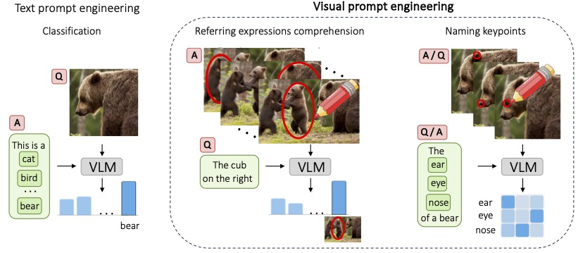

# What does CLIP know about a red circle? Visual Pr⭕mpt Engineering for VLMs 
## ICCV 2023, Oral

You can find the paper
[here](https://arxiv.org/abs/2304.06712)

---

---
Authors:

[Aleksandar (Suny) Shtedritski](https://github.com/suny-sht)

[Christian Rupprecht](https://chrirupp.github.io/)

[Andrea Vedaldi](https://www.robots.ox.ac.uk/~vedaldi/)

## Code

Code coming soon!


## Citation

If you find our work useful in your research, please consider citing:

```bibtex
@article{shtedritski2023does,
  title={What does clip know about a red circle? visual prompt engineering for vlms},
  author={Shtedritski, Aleksandar and Rupprecht, Christian and Vedaldi, Andrea},
  journal={arXiv preprint arXiv:2304.06712},
  year={2023}
},